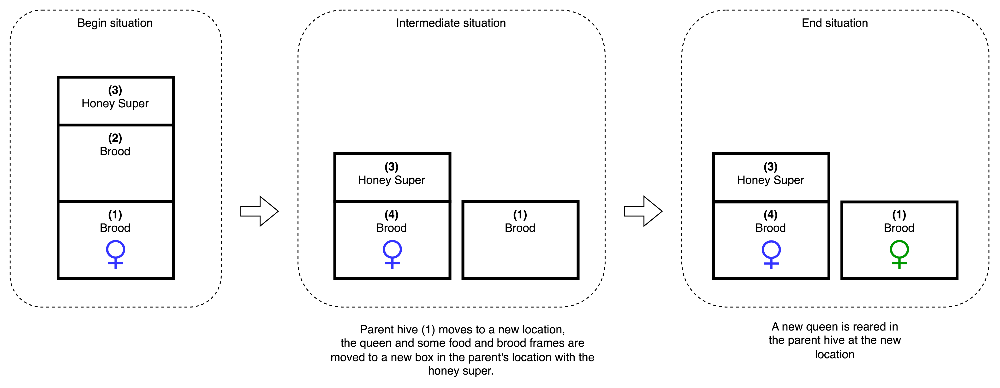
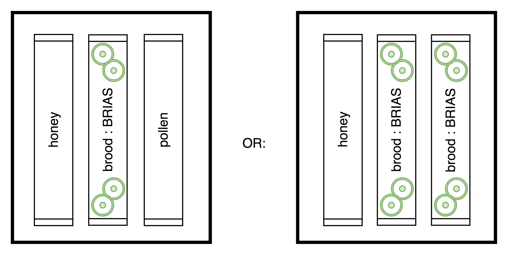

= Honey Bee Knowledge Base
:idprefix:
:idseparator: -
:sectanchors:
:sectlinks:
:sectnumlevels: 6
:sectnums:
:toc: macro
:toclevels: 6
:toc-title: Table of contents
:xrefstyle: full
:pdf-page-size: A4
:doctype: book
:page-layout: landscape

toc::[]

[page-layout=landscape]

== Intro

This book is a collection of knowledge gathered while learning and practising honey bee keeping.

== Contributing

Todo

== References

https://www.honeybeesuite.com

== Honey bees 

The honey bee colony has two main objectives:

1. To store enough food in their hive to survive dearths
2. To propagate its genetics via drones and reproduction via swarming 

=== Male and female castes

A colony generally contains one queen bee, a female; seasonally up to a few thousand drone bees, or males and tens of thousands of female worker bees.

==== Queen

*Productivity* +
A productive queen can fill a Langstroth deep frame with eggs within 3 days, at a rate of 1 egg per minute.

Young queens are more productive. And young in this context does not mean the age of the bee, but is measured in the amount of eggs she layed, as she has a limited amount of sperm. In warmer climates where a queen is laying the whole year round, a queen ages faster than in a colder climate with a brood break. 
Once the productivity of a queen drops, the workers will supersede her with a new queen. 

*Mating flights* +
Mating flight takes place:

* after the queen is fertile, and
* when the ambient temperature is above 20.5 degrees, and
* when and there is little wind, and
* when the time of day is around or after noon 

==== Worker

[cols="5, 1"]
.Worker tasks indoor
|===
| Task | Age   

| * Eating pollen for development of feeding glands +
| 0 .. 2 D

| * Cleaning empty cells
| 2 .. 5 D

| Nursing part I: +
* Feeding larvae + 
* Feeding queen +
* Heating +
* Grooming queen +
* Capping brood cells 
| 3 .. 11 D 

| Nursing part II: +
* Feeding mature bees +
* Grooming bees
| 3 - 21 D

| Nursing part III: +
* Receiving and store nectar from foragers +
* Processing nectar into honey +
* Vertilating for climate treatment +
* Throwing out dead and dying bees, and unusable wax parts +
* Compressing pollen in cells +
* Capping the honey and pollen cells when full, uncapping when required +
* Wax production and building comb 
| 12 .. 21 D

| * Guarding the entrance(s) to the nest
| 18 .. 21 D

|===

D = Days, M = Months, Y = Years, W = Weeks.

Facts:

* Guard bees have the largest concentration of venom in their gland. 
* Guard bees require 1 .. 3 seconds to distinguish a bee from the hive from a foreign bee.

[cols="5, 1"]
.Worker tasks outdoor
|===
| Task | Age   

| * Soldier, defending the nest +
| 22 D .. End of life

| * Foraging nectar, pollen, water, propolis
| 22 D .. End of life

|===

D = Days, M = Months, Y = Years, W = Weeks.

Facts:

* Nectar and water are collected in the honey stomach
* Pollen and propolis are collected on the rear legs
* Foragers can fly up to 3 kilometers 

==== Drone

Todo

=== Life cycle

The bee goes through different phases in its life cycle: egg, larva, pupa, adult bee.

.Birth cycle of honey bees
[#img-birth-cylce] 
 
{nbsp} +

*Egg* +
The queen lays eggs in cells made of beeswax inside the hive. The queen determines the gender of the bee before she lays the egg by fertilizing it or not. If the egg is fertilized, it will be female. If it is unfertilized is will me male. 

*Larva* +
The egg hatches into a larva after 3 days. The worker bees ensure the larva is fed and looked after. During this period, the larva will grow more than 1500 times its size. When after 6 days the larva reaches its full size and stretches upright in the cell, the top of the cell is sealed with bees wax in preparation for pupation.

*Pupa* + 
During this stage, the larva will shed its skins. Its eyes, legs and wings will develop along with the tiny hairs that cover the body. 

*Adult* +
On average, queen bees emerge from the egg in a total of 16 days, workers in 21 days and drones in 24 days. After emerging, new queen bees will fight among themselves until only one is left in the hive. 

[cols="1, 2, 2, 3, 1, 4, 3, 3, 5"]
.Bee development in days
|===
| Type | Egg (days) | Larva (days) | Pupae (days) | Birth (days) | Developing fertility (days) | Mating flights (days) | Laying eggs (days) | Lifetime after birth

| *Queen*
| 3 +
(1 - 3)
| 6 +
(4 - 9)
| 7 +
(10 - 16)
| 16
| 2 .. 4 +
(18 .. 19 .. 20)
| 7 .. 21 +
(25 .. 41)
| 2 .. 4 +
(27 .. 45)
| 1 .. 5 Y +
(degrading after 2 Y)

| *Worker*
| 3 +
(1 - 3)
| 6 +
(4 - 9)
| 12 +
(10 - 21)
| 21
|
| 
|
| Summer: 49 (6 W) +
Winter: up to 1 Y

| *Drone*
| 3 +
(1 - 3)
| 6 +
(4 - 9)
| 15 +
(10 - 24)
| 24
| 12 .. 16 +
(36 .. 40)
| Rest of lifetime
| 
| 30 .. 60
|===

D = Days, M = Months, Y = Years, W = Weeks.

=== Communication

==== Dancing

Todo

==== Pheromones

Todo

== Food, beverages and caulk

=== Nectar 

=== Honey

Honey is produced by bees who have collected nectar from vegetation or honeydew from other insects. Bees value honey for its sugars, which they consume to support general metabolic activity, especially that of their flight muscles during foraging, and as a food for their larvae. To this end bees stockpile honey to provide for themselves during ordinary foraging as well as during lean periods, as in overwintering.

During foraging bees use part of the nectar they collect to power their flight muscles. The majority of nectar collected is not used to directly nourish the insects but is instead destined for regurgitation, enzymatic digestion, followed by long-term storage as honey in the nest.

Nectar and honeydew consist out of sugar, water and trace elements like minerals. The processed honey is required to have a water content percentage that is low enough to prevent the honey from spoiling. By bees regurgitating the nectar, the water in it evaporates and the honey becomes more sugar-concentrated. Once the honey reaches a water percentage below 20 percent, the cell containing the honey is capped with a lid. Capping the honey with a lid prevents the hygroscopic honey from absorbing humidity in the air.

=== Pollen & bee bread

=== Water

=== Propolis

== Yearly schedule

A honey bee colony season is not defined by daylight length or temperature. 
Instead, it starts at the initiation of the pollen and nectar flow in the region. 
This can be the end of winter, or something completely different like July to November in locations like California, USA.

Four stages can be differentiated:
 
. Build up
. Reproduction 
. Food storage
. Dearth

.Seasonal colony development (source: Randy Oliver)
[#img-colony-development] 

{nbsp} +

=== Buildup 
During the buildup phase, there is an average net increase of 500-600 bees per day, even though about a 1000 bees die per day. 
This growth results in one additional frame being covered with bees every 4-5 days. 

==== Nutrition
An hour after rainfall or snow starts, the workers start cutting back on the amount of jelly fed to the brood. 
This is the result of no fresh nectar and pollen coming in, because the bees are not flying. 
After a couple of days of continuous bad weather, a colony can cannibalize all their brood and their honey storage. 
This creates a brood break and significantly decreases the honey crop and possibilities for splits of the colony, later in the season.

Therefore, a minimum of 6 weeks before the main honey flow, the buildup momentum needs to be started and maintained.
If during those 6 weeks the weather turns bad, pollen and a light sugar syrup can be fed to the bees to simulate a flow and keep momentum.
However, care must be taken to prevent the casting of a swarm (reproduction) during build-up.

Additional feeding in case of bad weather (per week): 

* 2.5 liters of light sugar syrup 
* 0.5 kilograms of pollen

==== Thermal
The rate of egg laying by the queen is restricted by the amount of comb 
that the cluster can make available and warm (assuming sufficient nutrition). 
Therefore cluster size is critical for the buildup phase, as a larger cluster can keep more comb warm and 
have a queen laying eggs non-stop in empty, clean and warm cells. 
Hence large clusters can grow faster than small ones, having more heating capacity.  

During the buildup phase, there is not much that a beekeeper can do to facilitate a large cluster. 
Instead, a good preparation in fall is required to enter the winter with a large cluster, plenty food and little mortality, 
to have a good size cluster at the buildup phase of the season, with plenty heating capacity. 

==== Expanding the brood nest
The queen doesn’t reach maximum egg laying capacity until the cluster covers all 10 frames with bees. 
Once all are covered, brood frames can be continuously harvested and replaced by drawn comb.
This way, the queen can be held at maximum egg laying capacity, and splits be created at will.

[#management-reversing-brood-boxes, ]

Coming out of the winter, the entire cluster will have moved from the bottom to the top of the hive (see figure below, situation on the left). 
The blue sphere indicates the bees and their brood, the orange arch their honey store. 

Empty combs below the brood or above a barrier of several inches of sealed honey are not used effectively by the bees 
for either the expansion of the brood nest or storage of honey. 
Heat that the bees and the larvae produce only goes up; it does not go down. 
The bottom box of the hive not being occupied by bees causes its temperature to be lower, and hence the queen may not lay eggs in there. 
This limits the space for the queen's egg laying to the blue sphere, and may prevent the queen from laying at maximum capacity due to space restriction. 

By reversing the top and bottom boxes, the now empty top of the hive is warmed up by the occupied box below (see figure below, situation on the right).
The queen however does not walk across honey bands, and therefore refuses to move to the top box for egg laying. 
Queen bees being queens, do not like to get their feet dirty with food. 
By swapping a frame in the middle of the brood nest of the bottom box with a drawn comb frame from the top box, the honey band is opened up. 
With this bridge across the honey created, the queen will now cross over with clean feet, and lay eggs in the top box. 
She now has an additional box available to her, and brood production can continue to increase. 

When reversing the boxes is desired, it should be done in early spring when temperatures are above 15 degrees celsius. 
Care must also be taken when the brood nest spans both boxes, as there need to be enough bees to keep both split brood nests warm. 

.Reversing brood boxes (source: Randy Oliver)
[#img-management-reversing-brood-boxes] 

{nbsp} +

=== Reproduction

=== Food Storage

=== Dearth

== Swarming

Swarming is a means of reproduction for honey bees. 
When a colony swarms, the old queen and about half the bees leave the parent colony to establish a new home. 
Before they leave, the workers raise a batch of queens so the old colony can have a new queen and a good chance of survival.

The swarm season begins in early spring when many flowers are blooming. 
It usually ends at the beginning of the summer nectar dearth. 
Although swarms can occur outside of swarm season, they are rare.

Swarming can be minimized or taken advantage of when the cues for it are understood. 

=== Swarming cues
During the <<Buildup>> phase, there is a shift in the adult bee vs brood ratio, see the figure below. 

At the spring turnover, the winter bees die off (blue purple area decreasing), and the amount of brood is going up (dotted line).
After that turnover point, there is much more brood than there are adult bees, which is stressful for the adult bees. 

Colonies tend to swarm when:

* They are full of sealed brood or there are too many bees, and 
* The queen runs out of room to lay eggs

==== Cue: enough sealed brood
The young larvae put out a pheromone E-β-ocimene that tells every bee in the hive that the queen is functioning and the brood nest is working. 
When the colony runs out of room and the queen doesn't have any room to lay eggs, then three days later there is no young larvae pheromone. 
When there's no young larvae pheromone, and there's pollen and nectar coming in, that tells the colony action needs to be taken immediately. 
It needs to start rearing queen cells, either supersedure cells (the queen is replaced) or swarm cells (the colony is splitting).
Therefore making sure the queen has plenty of room to lay is critical to prevent swarming. 

.Age class distribution of workers over the year (source: Randy Oliver)
[#img-swarming-age-class-distribution] 

{nbsp} +

One adult bee covers three cells with her body. That means that when a full frame of brood emerges, this will cover three full frames with bees. 
So colonies are ready to explode when frames contain that much sealed brood. 

.Frames full of sealed brood (source: Randy Oliver)
[#img-swarming-sealed-brood] 

{nbsp} +

The frame in the figure below is therefore a strong cue that this colony will swarm soon: 
there is no young larvae pheromone and no room to lay eggs. 

.Frame full of sealed brood without room to lay eggs (source: Randy Oliver)
[#img-swarming-no-room] 

{nbsp} +

==== Cue: too many bees
When there are too many bees, the queen pheromone is diluted among all those bees. 

.Queen pheromone diluted (source: Randy Oliver)
[#img-swarming-queen-pheromone-diluted] 
image::images/swarming-queen-pheromone-diluted.png[img-swarming-queen-pheromone-diluted, 900]
{nbsp} +

==== Suppressing the swarm impulse
The swarming impulse is suppressed by:

* Queen pheromone, and 
* Young larvae pheromone 

Therefore, it can be managed by: 

* Adding another box with frames with drawn comb
* Pulling frames of sealed brood, and replacing them by frames with drawn comb
* Removing adult bees 
* Splitting the colony into two

Splitting the colony should be performed a minimum of eight weeks before the main flow begins. 
This avoids swarms, and allows to make new queens.  

.Plan to prevent swarming (source: Randy Oliver)
[#img-swarming-plan-to-prevent] 
image::images/swarming-splits.png[img-swarming-plan-to-prevent, 900]
{nbsp} +

== Opening the hive 

=== Schedule

=== Smoke

=== Opening

=== Inspection

Goals of the inspection of the colony are:

. Checking if the colony is queen-right
. Checking if the colony has enough food storage
. Checking if there is enough space for new food and new eggs
. Checking if there are enough bees to care for and warm the brood
. Checking if there are diseases in the colony

==== Check: queen right

The colony is queen right when:

* It contains a queen, and or
* It contains Brood In All Stadia (BRIAS): eggs, larvae and pupae
* It contains even age brood, without too many age difference
* It contains contiguous brood, without too many empty cells in between the brood

.Healhty brood in all stadia with even age: BRIAS (source: Randy Oliver)
[#img-brias] 
image::images/brias.jpg[brias, 900]
{nbsp} +

Brood with uneven age can occur when there is not enough food available to feed the larvae, 
or can be an indication of disease.

.Brood with uneven age (source: Randy Oliver)
[#img-brood-uneven-age] 
image::images/brood-uneven-age.png[Brood with uneven age, 900]
{nbsp} +

.Contiguous brood (source: Randy Oliver)
[#img-brood-non-spotty] 
image::images/brood-non-spotty.png[Contiguous brood, 900]
{nbsp} +

Spotty brood can indicate:

* A lack of food in the hive: bees cannibalize the brood as a source of protein
* A malfunctioning queen that is not laying properly

Spotty brood in late summer and fall can be expected if there is not enough foraging. 
Spotty brood in spring or early summer is a serious problem as it can prevent the much required build-up of the colony. 

.Spotty brood (source: Randy Oliver)
[#img-brood-spotty] 

{nbsp} +

===== Act: not queen right

==== Check: enough food storage

A healthy frame with brood contains a proper amount of food. 

*Plenty of jelly* +
The cells containing larvae should be filled with plenty of jelly inside it. 
This jelly is consumed by the larvae and required to stimulate a healthy growth.
On day 5 (second day of larva stage), the nurse bees cover the bottom of the cells with jelly. 
This is the easiest way to tell whether the colony is getting adequate nutrition. 

If there is little or no jelly in the cells, this may indicate a food shortage. In that case, feeding with sugar water and / or pollen is beneficial. 

.Plenty of jelly (source: Randy Oliver)
[#img-plenty-of-jelly] 
image::images/brood-with-plenty-jelly.png[Plenty of jelly, 900]
{nbsp} +

*Plenty of pollen* +
The cells in between the brood, and especially around the brood should be filled with pollen inside it. The presence of pollen in the brood area stimulates nursing bees to consume it and produce jelly to feed the larvae. The pollen stored in between the brood is consumed first. The surplus brood is stored in a layer above the brood. 

If there is only little or no pollen in the cells, this may indicate a food shortage. In that case, feeding additional pollen is beneficial. 

.Plenty of pollen (source: Randy Oliver)
[#img-plenty-of-pollen] 
image::images/brood-with-food-storage.png[Plenty of pollen, 900]
{nbsp} +

*Plenty of honey above the pollen* +
The cells above the layers of pollen should be filled with honey and / or nectar. 

If there is only little or no honey or nectar in the cells, this may indicate a food shortage. In that case, feeding sugar water is beneficial. 

.Honey above the pollen (source: Randy Oliver)
[#img-honey-above-the-pollen] 

{nbsp} +

.Plenty of honey (source: Randy Oliver)
[#img-plenty-of-honey] 
image::images/brood-with-plenty-honey.jpg[Plenty of honey, 900]
{nbsp} +

===== Act: not enough food

==== Check: enough space 

Bees require enough empty cells for the queen to lay new eggs in, and for foragers to store nectar and pollen. 
When the colony determines that there is not enough space, they will take preparations and cast a swarm to divide the colony.
This subsequently leads to less bees and less honey production, and is therefore to be avoided or managed. 

To prevent the colony from casting a swarm, it is paramount to ensure the colony has enough space to grow. 
But not too much space, as this makes it too hard for them to heat it and control pests in it. 

===== Act: not enough space

==== Check: enough bees

===== Act: not enough bees

==== Check: diseases

===== Act: diseases found

See <<Diseases>>

No holes in the brood capping

No uncapped brood with pupae in the cell

== Splitting the colony 

TODO: https://konvib.be/?page_id=2764

When splitting the colony, a new queen needs to be raised for the colony without a queen. 
This can either be done from:

1. Having bees rear a new queen from an emergency cell +
Also referred to as walk-away splits. +
+ 
* Pro: It is an easy way to split. +
* Con: This takes ±27 days until the new queen is laying eggs. This is quite a set-back for a colony. +
* Con: It may result in a sub-optimal queen if an older larva is used, because it received less royal jelly. 
* Con: It requires the colony without queen to rear a queen from scratch, which is risky as the colony must: +

** Recognize that they are queenless and start raising emergency replacement queens
** Raise those larval queens to adulthood
** Survive the risky process of young queens fighting each other until only one survives
** Allow the new queen to mature and develop in the hive
** Allow her to fly out on (potentially dangerous) nuptial flights to mate with drones
** Allow her some time before she starts laying eggs in earnest

2. Placing a swarm cell in the queenless colony. +
Also referred to as queen cell splits +
+
* Con: It is more complex as walk-away splits. +
* Pro: This takes ± 10-12 days until the new queen is laying eggs. +
* Pro: Chances for an optimal queen is larger as the larva has received royal jelly right from the start.
* Pro: It does does not require the colony to rear and mature a new queen in the hive

3. Placing a purchased queen in the queenless colony +
* Pro: The queen should arrive mature, mated, and ready to lay eggs within 3 days after release; much less risky. 
* Pro: The queen should be raised from colonies with strong genes 

=== Split preparation: Queens for pennies

TODO
https://scientificbeekeeping.com/queens-for-pennies/

=== Split preparation: Finding the queen

TODO: tune and move 

*Steps for separating frames from the queen before splitting:*

1. Identify frames that are to be moved into a nuc
2. For each frame shake the bees off into their donor box, and place the frame into a new box
3. Place a queen excluder on top of the bee donor box (this can be either the same or a different colony)
4. Place the new box with frames on top of the queen excluder and put the lid on
5. Wait 30 minutes 
6. The frames in the new box are now populated with bees 
7. Remove the new box and place it on its own bottom board 

=== Adding bees to a colony without splitting 

Shake bees off of a frame in front of the hive. The older foragers will fly home, and not attempt to kill the queen. 
The nurse bees will walk in and start working without hurting the queen.  

<<<

=== Split: 5 frame walk away split - with queen (sweeper)

The queen is placed in a new hive (sweeper) with young bees that is placed a few meters away from the parent hive. +
The parent hive stays in the same location. +

The forager bees of the new hive fly off back to the parent hive. 
The sweeper therefore consists only of young bees and cannot immediately be used for collecting honey and pollination. 

*Goals:* 

* Preventing swarming
* Creating new colony
* Creating new queen

*Checks:*

1. Check that nighttime temperatures are not too cold for a split. +
+
There is a relatively small number of adult bees and a large number of brood cells. 
Nighttime temperatures must be fairly moderate to avoid chilled brood.

2. Ensure there are plenty of drones around. +
+
The virgin queen will need drones with which to mate. 
Don’t try raising queens in any type of split until drones are plentiful.
Depending on the climate, less or no drones may be available in early spring and late summer.

*Overview:*

.Veger - cursus (front view)
[#img-veger-course] 
image::images/veger-cursus.png[Veger cursus, 900]
{nbsp} +

*Steps for creating sweeper:*

[cols="1, 15"]
.Timetable summary for creating sweeper
[#optional-id%breakable] 
|===
| *Day* | *Action*  
| 1     | 1. Setup an empty six frame deep hive ('new hive' hereafter) +
2. Move queen and brood frames from the parent hive to the new hive, add foundation and drawn comb +
3. Shake 4 - 8 frames of bees from the parent hive into the new hive +
4. Reduce entrance +

| 1 | *Two - four hours later (after foragers flew off):* +
5. Perform varroa treatment with oxalic acid dribble +
6. Add 2 frames with food resources: honey and pollen +
7. Feed with sugar syrup +

| 3 | 8. Perform varroa treatment with oxalic acid dribble.

| 8 | 9. Perform inspection

|===

.Veger - new hive (front view)
[#img-veger-hive] 

. Setup an empty six frame deep hive ('new hive' hereafter). +
+
The new hive should be placed at least a few meters away from the parent hive. 

. Create the following situation in the new hive:
** Move two frames with eggs and young larvae including the queen from the parent hive to the new hive.
Make sure there is no capped brood on any frames, to aid varroa treatment (see below).
** Add a frame of foundation comb so that the young bees can build.
** Add a frame of drawn out comb so that the queen can continue laying eggs.

. Shake more than half of the bees (e.g. 4-8 frames) off of the parent hive's frames into the new hive. +
+
Such a large loss of bees to the parent hive simulates a natural swarm. 
The shook bees will consist of both nurse bees and forager bees. 
The forager bees that are shook into the new hive will eventually fly back to their parent hive,
because that still resides at their home location. The foragers are therefore only temporary 
residents of the new hive. +
+
TODO: optionally: leave the hive entrance closed for 1 day to prevent flying back.

. Reduce the new hive's entrance to make it easier for the new colony to defend their hive. 

. Perform a varroa treatment with oxalic acid. +
+
Oxalic acid drizzle does not reach varroa mites in capped brood cells. 
However as there is no capped brood (only eggs and larvae were moved), 
the mites climb on to the worker bees. 
This makes an oxalic acid dribble effective, as the oxalic acid dribble then reaches most 
or all of the mites. 

+
After a varroa treatment with oxalic acid, the honey cannot be used for human consumption. +

. Add a frame of honey and a frame of pollen. +
Shake off all bees back into the parent hive before inserting it in the new hive, in case those bees are foragers. +
Add these frames _after_ the foragers in the new hive flew back to their parent hive, to prevent robbing. 

. Feed the new hive with <<Sugar syrup 1:1>>. +
+
This will stimulate the bees to build out the foundation comb, and the queen to lay eggs as if 
there is an incoming nectar flow.  
+
It is important to feed the new hive _after_ its foragers flew back to their parent hive. 
If feeding starts too soon, the foragers returning to their parent hive may recruit bees to the new hive. 
This will cause robbery of the new hive's food stores by the parent hive.

. Perform a varroa treatment with oxalic acid. +

. Give the bees around a week to settle in, then do an inspection. +
+
During the inspection, it is important to determine the presence of eggs and whether the bees have enough room. 
When the bees are working on about 4 frames (assuming 6 frame equipment), it is time to give them more space. 
Then, either:

* the bees and frames can be moved to a 10 frame box with 8 frames and 2 follower boards, or 
* a honey super can be added on top. 

{nbsp} +

*Steps for parent hive:* +
After the queen is removed, the workers left behind quickly notice they have lost their queen and 
will begin raising new queens in emergency cells placed throughout the frames, often within 4 - 12 hours.

[cols="1, 15"]
.Timetable summary for parent hive
|===
| *Day* | *Action*  
| 1     | 1. Ensure the parent hive has eggs and young larvae that the bees can promote to become queens +
| 2     | 2. The worker bees will attempt to rear a new queen.
| 12    | *In the evening:* +
3. Either open all queen cells or create a three frame queen cell nuc with surplus queen cells. + 

It is important to not wait until day 13, because the colony can swarm on day 13.  
| 25 .. 30    | 4. Perform an inspection to check if the queen is laying eggs +
5. Perform varroa treatment 
|===

. Ensure the parent hive has eggs (1..3 days old) and larvae (1 day old). +
The bees require this to promote several of those to become queens.
If there are no eggs and/or young larvae, swap in a frame from a different hive that does. 
+ 
Besides enabling queen rearing, open brood has the function of suppressing worker's ovaries in a colony that has become queenless. 
After a colony loses the queen, the amount of open brood soon decreases and then disappears. 
Without open-brood pheromone to suppress the worker ovaries, some of the workers will begin to lay unfertilized eggs which will mature into drones.
It can be extremely hard to get the laying workers to accept a new queen. 

. From 4 to 12 hours after the queen disappeared, the worker bees will attempt rearing a new queen. +
+
They do so by building an emergency queen cell around one or more cells with brood containing
larvae that are 1..3 days old (after a 3 day egg phase, so 4..6 days in total). 
+
Be aware these newly queenless colonies often react like any other colony that has lost their queen — they may become more defensive of their home so 
wearing protective gear when near this colony is advised. It is best to avoid opening the hive until at least day seven to give the testy bees time to tend to their business without adding more stress by opening the hive.

. 12 days after making the split, one of the following actions should be taken in the evening to prevent swarming:

** Carefully open up all queen cells and force all queens to emerge. +
Because it is evening, the queens won't leave in a swarm, and instead fight each other during the night until only one remains alive. 

** Create another three frame queen nuc (see <<Split: 3 frame swarm control split - with queen cells>>) +
In some cases, there is enough food and bees remaining in the parent hive for another split.
In that case, instead of opening up _all_ queen cells, some queen cells can be moved to a small queen cell nuc. 
Two or three queen cells should be left behind in the parent hive, and be in each other's vicinity
so that the queens can find each other easily. 

. Perform an inspection to check if the queen is laying eggs
+
Give the bees around two weeks after the queen emerges, then do an inspection. 
During the inspection, it is important to determine the presence of eggs to know whether the queen successfully mated.

. Perform a varroa treatment with oxalic acid. +
+
A single oxalic acid dribble can be performed between day 25 and day 30 after the split. 
All capped brood will then have emerged (24 days for drones), and the new brood layed by the queen will not be capped yet.
+
After a varroa treatment with oxalic acid, the honey cannot be used for human consumption. 

. Perform an inspection to check if the queen is laying eggs +
+
If 22 days after the split there are still no eggs, combine the split with a queen-right colony.

. Perform an inspection every week and check and whether the bees have enough room. +
+
When the bees are working on 4-5 frames, it is time to give them more space by moving them to a 10 frame box with foundation comb added.

<<<

=== Split: 5 frame walk away split - with queen cell (sweeper) 

This split is very similar to <<Split: 5 frame walk away split - with queen (sweeper)>>.
It is different in that not the queen is moved to the new hive, but one or more queen cells from the parent hive. 
This has the advantage over a split with a queen that the new queen could be laying within 10-12 days
instead of ±27 days. That is a smaller brood break, which results in a more populous colony once the
main nectar flow starts.

*Goals:* 

* Preventing swarming
* Creating new colony
* Creating new queen

*Checks:*

1. Check that nighttime temperatures are not too cold for a split. +
+
There is a relatively small number of adult bees and a large number of brood cells. 
Nighttime temperatures must be fairly moderate to avoid chilled brood.

2. Ensure there are plenty of drones around. +
+
The virgin queen will need drones with which to mate. 
Don’t try raising queens in any type of split until drones are plentiful.
Depending on the climate, less or no drones may be available in early spring and late summer. 

3. Ensure the queen cells in the hive are swarm cells, not supersedure cells. +
+
A colony raises supersedure cells when a queen dies, becomes ill, damaged, or loses strength. 
The colony cannot survive without a healthy egg-laying queen. 
Therefore if a colony raises supersedure cells,
it is probably best to leave them alone, and not use them to make a split.  
See <<Different types of queen cells>> on how to distinguish different types of queen cells. 

*Overview:*

.Veger - queen cell (front view)
[#img-veger-queen-cell] 

{nbsp} +

*Steps for creating sweeper:*

[cols="1, 15"]
.Timetable summary for creating sweeper
|===
| *Day* | *Action*  
| 1     | 1. Setup an empty six frame deep hive ('new hive' hereafter) +
2. Move 2 brood frames without queen cells from the parent hive to the new hive, add foundation and drawn comb +
3. Keep a frame slot free on the edge of the hive +
4. Shake 4-8 frames of bees from the parent hive into the new hive +
5. Reduce entrance +

| 1 | *Two - four hours later (after foragers flew off):* +
6. Perform varroa treatment with oxalic acid dribble +
7. Add 2 frames with food resources: honey and pollen +
8. Feed with sugar syrup +
9. Wait for 24 hours for the workers to realize they are queenless

| 2 | 10. Move the frames aside and insert a frame with one or more queen cells in the middle of the brood nest.

| 19..20 | 11. Perform an inspection to check if the queen is laying eggs +
12. Perform varroa treatment

| 23 | 13. Perform an inspection to check if the queen is laying eggs

|===

.Veger - new hive (front view)
[#img-veger-hive-queen-cell] 

. Setup an empty six frame deep hive ('new hive' hereafter). +
+
The new hive should be placed at least a few meters away from the parent hive. 

. Create the following situation in the new hive:

** Move two frames with eggs and young larvae, without the queen and without queen cells from the parent hive to the new hive.
Make sure there is no capped brood on any frames, to aid varroa treatment (see below).
** Add a frame of foundation comb so that the young bees can build.
** Add a frame of drawn out comb so that the queen can continue laying eggs. +
+ 
Ensure the new hive has open brood.
Open brood has the function of suppressing worker's ovaries in a colony that has become queenless. 
After a colony loses the queen, the amount of open brood soon decreases and then disappears. 
Without open-brood pheromone to suppress the worker ovaries, some of the workers will begin to lay unfertilized eggs which will mature into drones.
It can be extremely hard to get the laying workers to accept a new queen. 

. Keep a frame slot free on the edge of the hive +
+
Make sure all frames are adjacent and bees can cross between all frames in the hive, and keep the slot on one
side of the hive empty. The room will be used later on, to insert a frame with a queen cell.

. Shake more than half of the bees (e.g. 4-8 frames) off of the parent hive's frames into the new hive. +
+
Such a large loss of bees to the parent hive simulates a natural swarm. 
The shook bees will consist of both nurse bees and forager bees. 
The forager bees that are shook into the new hive will eventually fly back to their parent hive,
because that still resides at their home location. The foragers are therefore only temporary 
residents of the new hive. 

. Reduce the new hive's entrance to make it easier for the new colony to defend their hive. 

. Perform a varroa treatment with oxalic acid. +
+
Oxalic acid drizzle does not reach varroa mites in capped brood cells. 
However as there is no capped brood (only eggs and larvae were moved), 
the mites climb on to the worker bees. 
This makes an oxalic acid dribble effective, as the oxalic acid dribble then reaches most 
or all of the mites. 

+
After a varroa treatment with oxalic acid, the honey cannot be used for human consumption. +

. Add a frame of honey and a frame of pollen. +
Shake off all bees back into the parent hive before inserting it in the new hive, in case those bees are foragers. +
Add these frames _after_ the foragers in the new hive flew back to their parent hive, to prevent robbing. 

. Feed the new hive with <<Sugar syrup 1:1>> (or sugar fondant). +
+
This will stimulate the bees to build out the foundation comb, and the queen to lay eggs as if 
there is an incoming nectar flow.  
+
It is important to feed the new hive _after_ its foragers flew back to their parent hive. 
If feeding starts too soon, the foragers returning to their parent hive may recruit bees to the new hive. 
This will cause robbery of the new hive's food stores by the parent hive. +

. Wait for 24 hours for the workers to realize they are queenless. +
+
After moving the bees to a new hive without a queen, the bees are initially still under the impression that they have a queen.
It takes around 2-12 hours before the colony realizes that they are now queenless. 
Before that, the colony will not accept a new queen being introduced into the colony and will kill the new 'intruder' queen.
By waiting for the bees to realize they are queenless, the colony is more likely to accept the new queen emerging from the inserted queen cell. 

. Move the frames aside and insert a frame with one or more queen cells in the middle of the brood nest. +
+
Try to find a frame without capped brood, to aid in varroa treatment (see below). If the frame with 
the queen cell does have capped brood, the queen cell can be cut out and placed in a frame without capped brood. 
Note that extreme care is needed when handling queen cells to prevent them from being damaged and harming the queen. +
+
Alternatively if there is only little capped brood on the frame with the queen cell, the capped brood can be punctured
with a needle. The worker bees will then remove the dead pupae from their cells, forcing the varroa mites to climb out of the cells.

. Perform an inspection to check if the queen is laying eggs
+
Give the bees around two weeks after the queen cell is due to emerge, then do an inspection. 
During the inspection, it is important to determine the presence of eggs to know whether the queen successfully mated.

. Perform a varroa treatment with oxalic acid. +
+
A single oxalic acid dribble can be performed on day 19 (or day 20 if it's cold) after the split. 
+
By treating the colony 18 days after the split, the treatment is performed before the new brood is capped: +
2 days queen maturing + 7 days mating flight + 9 days for new brood to be capped = 18. +
+
Oxalic acid drizzle does not reach varroa mites in capped brood cells. However as there is no capped brood (only eggs and larvae were moved), the mites climb on to the worker bees. This makes an oxalic acid dribble effective, as the oxalic acid dribble then reaches most or all of the mites.
+
After a varroa treatment with oxalic acid, the honey cannot be used for human consumption. +

. If 22 days after the split there are still no eggs, combine the split with a queen-right colony. 

. Perform an inspection every week and check and whether the bees have enough room. +
+
When the bees are working on 4-5 frames, it is time to give them more space by moving them to a 10 frame box with foundation comb added. 

{nbsp} +

*Steps for parent hive:*

There are no further steps to be taken for the parent hive: it has a queen, brood and food resources.

<<<

=== Split: 5 frame cut down split - with queen (flyer)

A cut-down split is a special technique often used by comb honey producers. 
The purpose of a cut-down split is to maximize the number of foragers that are bringing in nectar by minimizing the amount of brood a colony has to care for.
With little brood to feed, foragers concentrate on bringing home nectar rather than pollen, and nurse bees without brood responsibility soon become foragers as well. 
The result is lots of honey in a short period of time.

Timing of a cut-down split it important. 
To be effective, the cut-down should be completed just before the start of a main nectar flow. 
No matter how well the split is organized, it won’t produce honey if there is no nectar to collect.

The queen is placed in a new hive (flyer) with forager bees that is placed at the location of the parent hive.
The parent hive is moved at least a few meters away from the original home location. +

The forager bees of the parent hive fly off back to the new hive, their home location. 
The flyer therefore can immediately be used for collecting honey and pollination. 

*Goals:* 

* Preventing swarming
* Creating new colony
* Creating new queen
* Harvesting lots of honey

*Assumptions:*

* The donor colony has been treated for varroa mites previously. +
Hence, a varroa treatment is not required for this split.  

*Checks:*

1. Check that nighttime temperatures are not too cold for a split. +
+
There is a relatively small number of adult bees and a large number of brood cells. 
Nighttime temperatures must be fairly moderate to avoid chilled brood.

2. Ensure there are plenty of drones around. +
+
The virgin queen will need drones with which to mate. 
Don’t try raising queens in any type of split until drones are plentiful.
Depending on the climate, less or no drones may be available in early spring and late summer.

3. Ensure the split can be completed just before the start of a large nectar flow. +
+ 
The purpose of this type of split is to have a large group of foragers hoard as much nectar as possible. 
If there is no nectar to forage, this split will not be as succesful.

*Overview:*

.Flyer - cursus (front view)
[#img-flyer-course] 

{nbsp} +

*Steps for creating flyer:*

[cols="1, 15"]
.Timetable summary for creating flyer
|===
| *Day* | *Action*  
| 1     | 1. Move the parent hive to a new location +
2. Setup an empty ten frame deep hive at the parent location ('new hive' hereafter) +
3. Move queen and capped brood frames from the parent hive to the new hive +
4. Fill the new hive with drawn comb +
5. Add a queen excluder op top of the new hive +
6. Add a honey super on top of the new hive

|===

.Flyer - new hive with queen excluder (front view)
[#img-flyer-hive-queen] 
image::images/vlieger-cursus-new-hive.png[Flyer hive queen, 500, role=right]

. Move the parent hive to a new location +
+
The parent hive should be placed at least a few meters away from its original parent hive.

. Setup an empty ten frame deep hive at the original parent location ('new hive' hereafter)

. Move two or three frames with capped brood including the queen from the parent hive to the bottom of the new hive. +
+
Open brood should remain in the parent hive as much as possible; the new hive's brood should be mostly capped. 
The capped brood will emerge soon, and these new nurse nurse bees will not have a lot of brood to care for. 
Therefore they will start building comb — even in comb honey supers.

. Fill the new hive with drawn comb

. Add a queen excluder op top of the new hive. +
+
This prevents the queen from laying eggs in the honey super on top, as she cannot pass through the excluder 
and is confined to the bottom box. 
It also prevents the bees from storing pollen in the honey super, making sure that honey stays pure. 

. Add a honey super on top of the new hive. +
+ 
With no open brood to take care of, nurse bees will shift their task to foraging sooner. 
That, combined with the already abundant amount of foragers flying back from the parent hive, the split is ready to collect lots of honey. 

{nbsp} +

*Steps for parent hive:*

The parent hive won’t swarm because it doesn’t have a queen nor enough capped brood.  
It will raise a new queen from the eggs, but by the time the colony is strong, swarm season will be mostly over.

See the same steps in <<Split: 5 frame walk away split - with queen (sweeper)>> for the parent hive. 

<<<

=== Split: 3 frame swarm control split - with queen cells

(Doppen aflegger)

*Goals:* 

* Preventing swarming
* Creating new colony
* Creating new queen

*Checks:*

1. Check that nighttime temperatures are not too cold for a split. +
+
There is a relatively small number of adult bees and a large number of brood cells. 
Nighttime temperatures must be fairly moderate to avoid chilled brood.

2. Ensure there are plenty of drones around. +
+
The virgin queen will need drones with which to mate. 
Don’t try raising queens in any type of split until drones are plentiful.
Depending on the climate, less or no drones may be available in early spring and late summer. 

3. Ensure the queen cells are swarm cells, not supersedure cells. +
+ 
A colony raises supersedure cells when a queen dies, becomes ill, damaged, or loses strength. 
The colony cannot survive without a healthy egg-laying queen. 
Therefore if a colony raises supersedure cells,
it is probably best to leave them alone, and not use them to make a split.  
See <<Different types of queen cells>> on how to distinguish different types of queen cells. 

*Overview:*

.Doppen aflegger (front view)
[#img-doppenaflegger-cursus] 
image::images/doppenaflegger-cursus.png[Doppen aflegger cursus, 900]

*Steps for 3 frame split:*

[cols="1, 15"]
.Timetable summary for creating sweeper
|===
| *Day* | *Action*  
| 1     | 1. Setup an empty three frame deep hive ('new hive' hereafter) +
2. Move 1 or 2 brood frames with queen cells from the parent hive to the new hive +
3. Keep a frame slot free on the edge of the hive +
4. Shake 1-2 frames of bees from the parent hive into the new hive +
5. Reduce entrance +

| 1 | *Two - four hours later (after foragers flew off):* +
6. Perform varroa treatment with oxalic acid dribble +
7. Add 1 or 2 frames with food resources: honey and pollen +
8. Feed with sugar syrup +

| 19..20 | 9. Perform an inspection to check if the queen is laying eggs +
10. Perform varroa treatment

| 23 | 11. Perform an inspection to check if the queen is laying eggs +

|===

.Doppen aflegger - new hive (front view)
[#img-doppenaflegger-hive] 

. Setup an empty three frame deep hive ('new hive' hereafter)

. Create the following situation in the new hive:
** Move one frame with brias including the queen cells from the parent hive to the new hive.
** Keep room for 2 additional frames.
+
OR: 
** Move multiple frames with brias including the queen cells from the parent hive to the new hive. +
+
Try to find a frame without capped brood, to aid in varroa treatment (see below). 
If the frame with the queen cell does have capped brood, the queen cell can be cut out and placed in a frame without capped brood. 
Note that extreme care is needed when handling queen cells to prevent them from being damaged and harming the queen.
+
Alternatively if there is only little capped brood on the frame with the queen cell, the capped brood can be punctured with a needle. 
The worker bees will then remove the dead pupae from their cells, forcing the varroa mites to climb out of the cells.
+
Ensure the new hive has open brood.
Open brood has the function of suppressing worker's ovaries in a colony that has become queenless. 
After a colony loses the queen, the amount of open brood soon decreases and then disappears. 
Without open-brood pheromone to suppress the worker ovaries, some of the workers will begin to lay unfertilized eggs which will mature into drones.
It can be extremely hard to get the laying workers to accept a new queen. 

. Keep a frame slot free on the edge of the hive. +
+
Make sure all frames are adjacent and bees can cross between all frames in the hive, and keep the slot on one side of the hive empty. 
The room will be used later on, to insert a frame with honey.

. Shake the bees of 1-2 frames off of the parent hive's frames into the new hive. +
+
The shook bees will consist of both nurse bees and forager bees. 
The forager bees that are shook into the new hive will eventually fly back to their parent hive,
because that still resides at their home location. The foragers are therefore only temporary 
residents of the new hive. 

. Reduce the new hive's entrance to make it easier for the new colony to defend their hive. 

. Perform a varroa treatment with oxalic acid. +
+
Oxalic acid drizzle does not reach varroa mites in capped brood cells. 
However as there is little capped brood, the mites climb on to the worker bees. 
This makes an oxalic acid dribble effective, as the oxalic acid dribble then reaches most 
or all of the mites. 
+
After a varroa treatment with oxalic acid, the honey cannot be used for human consumption. +

. Add 1 or 2 frames of honey and a frame of pollen. +
+
Shake off all bees back into the parent hive before inserting it in the new hive, in case those bees are foragers. +
Add these frames _after_ its foragers flew back to their parent hive, to prevent robbing. 

. Feed the new hive with <<Sugar syrup 1:1>> (or sugar fondant) to encourage them to draw wax. +
+
It is important to feed the new hive _after_ its foragers flew back to their parent hive. 
If feeding starts too soon, the foragers returning to their parent hive may recruit bees to the new hive. 
This will cause robbery of the new hive's food stores by the parent hive. +
+ 
A colony this small will not swarm because the cues to swarm are absent. 
Instead, the queens will emerge from their queen cells, and fight each other until the strongest remains. 

. Perform an inspection to check if the queen is laying eggs +
+
Give the bees around two weeks after the queen cell is due to emerge, then do an inspection. 
During the inspection, it is important to determine the presence of eggs to know whether the queen successfully mated.

. Perform a varroa treatment with oxalic acid. +
+
A single oxalic acid dribble can be performed on day 19 (or day 20 if it's cold) after the split. 
+
By treating the colony 18 days after the split, the treatment is performed before the new brood is capped: +
2 days queen maturing + 7 days mating flight + 9 days for new brood to be capped = 18. +
+
Oxalic acid drizzle does not reach varroa mites in capped brood cells. However as there is little capped brood, 
the mites climb on to the worker bees. This makes an oxalic acid dribble effective, as the oxalic acid dribble then 
reaches most or all of the mites.
+
After a varroa treatment with oxalic acid, the honey cannot be used for human consumption. +

. If 22 days after the split there are still no eggs, combine the split with a queen-right colony. 

. Perform an inspection every week and check and whether the bees have enough room. +
+
When the bees are working on all 3 frames, it is time to give them more space by moving them to a 6 frame box with foundation comb added. 

<<<

== Different types of queen cells

TODO

== Single brood chamber vs multiple brood chambers 

In this practice, the colony is managed in a single deep brood chamber, instead of in multiple brood chambers.
The colony spends the winter in the single deep brood chamber. In spring, a honey super is added, 
separated by a queen excluder.  
This greatly simplifies the management of the colony. 

Some advantages are:

* The super goes on a little earlier than it would in multiple brood chambers. +
This is required because it alleviates congestion and gives the bees more space. +
By adding the honey super on earlier, honey is stored in the super earlier on in the season. 

* Inspection is easier and quicker. +
There is only a single brood chamber with 10 frames to go through. +
This makes it easier to find the queen and inspect for diseases.

* Disease treatment is easier. + 
The brood nest is more compact and therefore easier and cheaper to treat against diseases. 

* Moving the hive is easier. +
A single brood chamber is easier to move around because it is smaller and weighs less. 

* More honey is stored in the honey super. +
With double deep brood chambers, more honey is stored in both brood chambers.
With a single deep brood chamber, the brood chamber is mostly used for rearing brood, and most of the honey is stored in the honey super.  
The single brood chamber practice therefore leads to more harvestable honey in the super. 

Steps:

.Single deep beekeeping, January - June (front view) - Source: The Bee Whisperer
[#img-single-deep-beekeeping-1] 

* Januari to April +
Feed the bees <<Sugar syrup 1:1>>. 
Thin sucrose solution gets the queen laying eggs and worker bees to build comb. 
Workers don’t build comb unless nectar is coming in, which a thin sugar solution mimics. 
Honey keeps them alive in the winter, to put fat bodies on the bees, it does not stimulate them to build comb. 
In April, there will typically be around four frames of brood and one or two frames of honey. 

* May +
In May, there will typically be around six to eight frames of brood and two frames of honey. 
Once the bees are occupying around eight frames, add a honey super on top with drawn comb. +
+
The bees don't see frames with foundation the same way we humans do. The bees don't count this space as available space 
until it is actually drawn out. That means that when a honey super with only foundation frames is added on top of the brood chamber, 
the bees don't see it as additional space, as they can't yet put anything in there. Therefore, 
when adding a honey super with foundation frames on top of a full brood box, it is likely that the bees
will cast a swarm because they run out of usable space. Therefore, the honey super should contain frames
with drawn comb. +
+
At the end of May, there will typically be around four frames of brood in the super box (2).

* June +
In June, the super box (2) typically gets more filled with brood, allowing the colony to get strong
with many bees. However, too much brood in the super box (2) will lead to swarming due to congestion in the hive. 
To prevent swarming, 
remove brood frames if there are more than four brood frames in the super box (2). 
These sur-plus frames can be used
to strengthen other weak colonies or to create nucs. 

* June 10-20 +
The queen is moved to the bottom brood box (1), and a queen excluder is added. 

* July +
In July, the brood in the honey super box (2) has emerged and is replaced with honey. 
The bottom box (1) is typically filled with 8-9 frames of brood.
Another super (3) is added for the bees to fill with honey. 

.Single deep beekeeping, July - December (front view) - Source: The Bee Whisperer
[#img-single-deep-beekeeping-2] 
image::images/single-deep-beekeeping-2.png[Single deep beekeeping 2, 900]

* August +
In August, another super (4) is typically added.

* September +
Somewhere in September, when the main honey flow ends and the dearth starts to set in, the honey is harvested. 
The honey supers are taken off and the honey harvested. If there is still a honey flow, a super box
can be added back on top. +
+
However, when there is no honey flow, the bottom brood box (1) will not have
_any_ honey in it, and still contains quite a bit of brood. This is a recipe for disaster if the bees are not fed
immediately after removing the honey. +
+
Therefore, a feeder with <<Sugar syrup 1:2>> is added on top of the hive inside a super box. 
This thick mixture will prevent the bees from having to work hard to remove the moisture from 
the syrup.

* October +
In October, the winter feeding should be finished as it might get too cold for bees to move around
and store syrup in the hive. Depending on the region and the winter season, the hive 
should now contain around 15 kg of sugar syrup.
This is also a good time for an oxalic acid treatment. 

* November + 
In November, the usual winter preparations are done; mouse guards are installed and where needed
the hive is insulated. 

== Diseases

TODO

=== Varroa 

TODO: translate. 

Als varroa bestreden wordt,
neemt de infectie met DWV in gelijke mate af met
de mijten. Om dit virus op een adequate manier
te onderdrukken is het noodzakelijk om varroa te
bestrijden voordat de productie van winterbijen
begint. Daarom moet varroa vóór 1 september
bestreden zijn. Gebeurt dit niet dan ‘overwintert’
het virus op de bijen en vormt het in het volgende
bijenjaar een bedreiging.

Recent onderzoek heeft laten zien dat een geforceerde broedstop eind juli / begin augustus gebruikt kan worden om oxaalzuur toe te passen. Door de koningin over een periode van 12 tot 14 dagen in een kluisje op te sluiten, ontstaat er exact 21 dagen na de start van het opsluiten een korte periode waarin geen gesloten broed aanwezig is. In deze periode kan oxaalzuur gesproeid worden met een effectiviteit van 98% tegen varroa (zie dosering hieronder). Het onderzoek liet zien dat de kans op sterfte van de koningin zeer gering was en dat de overlevingskansen in de winterperiode zeer gunstig waren.

 Voor een goede overwintering
is het essentieel dat deze bijen gezond zijn. Dat
kan alleen als de varroa-infectiedruk laag is. Het is
daarom belangrijk om varroamijten vóór de vorming
van de winterbijen te bestrijden. Dit betekent dat de
zomerbehandeling tegen varroa vóór 1 september
afgerond moet zijn. 

Meer informatie is hier te vinden: http://edepot.wur.nl/239714

https://www.honeybeesuite.com/how-to-apply-an-oxalic-acid-dribble/

== Feeding

=== Sugar syrup 

=== Sugar syrup 1:1

1 part water, 1 part sugar 

=== Sugar syrup 1:2

1 part water, 2 parts sugar
provides a thicker syrup that requires less effort from the bees to dehydrate it down for the winter and is the ratio recommended for fall feeding. 